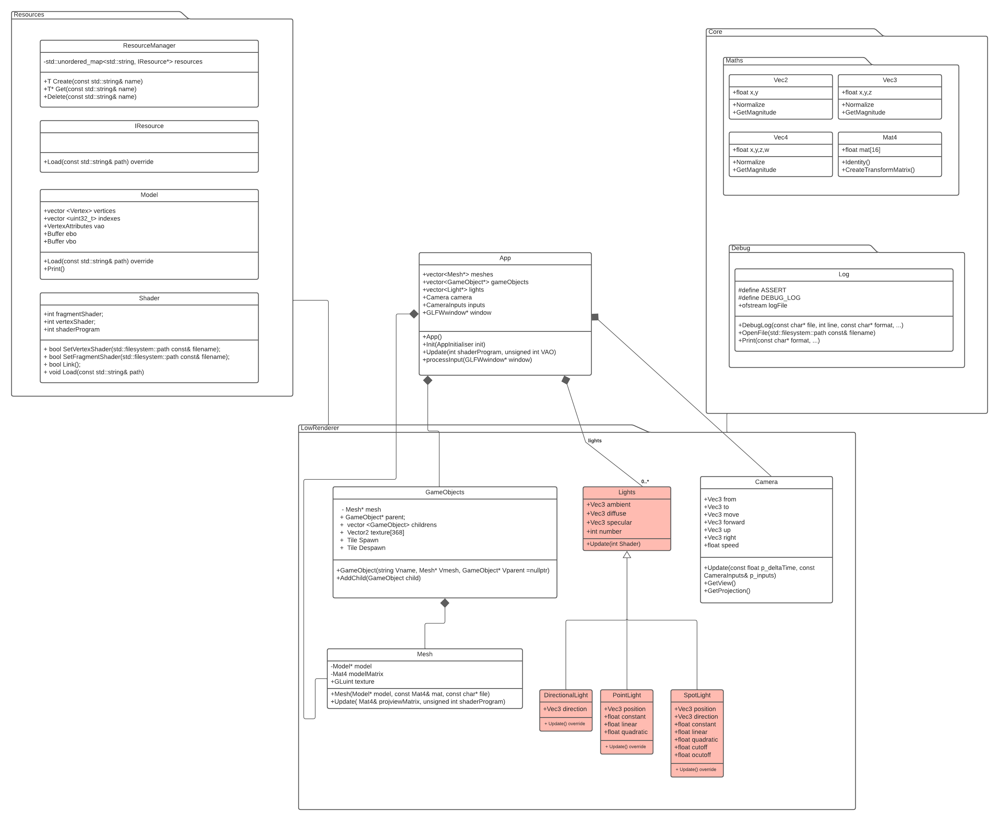

# Modern OpenGL
The objective of this project was to create an engine that can load a 3d model from an obj file.
## Controls

```python

W -> Forward
S -> Backward
A -> Left
D -> Right
Left Control -> Forward
Space -> Upward
Escape -> Downward

```

## Structure


## Add lights
To add new lights, go to the Init function of App.cpp
you must first define the number of your light types
```cpp
//number of lights
	nbrOfDir = 1;
	nbrOfPoint = 0;
	nbrOfSpot = 0;
```
It is then necessary to add the different types of lights in the lights vector according to the parameters of the functions


```cpp
//---------------------------------------------------
	//directional (remove the //)
	//---------------------------------------------------
	lights.push_back((new DirectionalLight(Vec3(0.05f, 0.05f, 0.05f), Vec3(0.5f, 0.5f, 0.5f), Vec3(1.0f, 1.0f, 1), Vec3(0, -1, 0))));
	//lights.push_back((new DirectionalLight(Vec3(0.05f, 0.05f, 0.05f), Vec3(0.5f, 0.5f, 0.5f), Vec3(1.0f, 1.0f, 1), Vec3(-1, 0, 0))));
	//---------------------------------------------------
	//point (remove the //)
	//---------------------------------------------------
	//lights.push_back(new PointLight(Vec3(0, -2, -2), Vec3(0.05f, 0.05f, 0.05f), Vec3(0.8f, 0.8f, 0.8f), Vec3(1.0f, 1.0f, 1.0f), 1.0f, 0.09, 0.032));
	//---------------------------------------------------
	//spot (remove the //)
	//---------------------------------------------------
	//lights.push_back(new SpotLight(Vec3(0, -2, 0), Vec3(0, -1, 0), Vec3(0, 0,0), Vec3(1.f,0.f, 1.f), Vec3(0.1f, 0.1f, 1.0f), 0.01f, 0.09, 0.032, cos(rad(15.f)), cos(rad(17.f))));
	
```
## Add Resources with ResourceManager
First, Create a pointer of your desired resource (there is only one for now and its Model)

Then Create a variable of type ResourceManager
```cpp
Model* cube;
ResourceManager resources;
```

Use the function Create to create the resource with its location as the parameter

```cpp
resources.Create<Model>("Resources/Obj/malbazar.obj");
```
Then get the model to the pointer that we first initialised 
```cpp
	model = resources.Get<Model>("Resources/Obj/malbazar.obj");
```
## Add meshes/GameObjects

Create the disered mesh following its creator and its parameter, then add the mesh to the meshes vector of the App.
```cpp
app.meshes.push_back(new Mesh(cube, Mat4().CreateTransformMatrix(Vec3(0, 0, 0), Vec3(0, -5, 0), Vec3(10, 1, 10)), "sample.png"));

	app.meshes.push_back(new Mesh(model, Mat4().CreateTransformMatrix(Vec3(0, 180, 0), Vec3(0, -2, 0), Vec3(0.01, 0.01, 0.01)), "Resources/Textures/malbazar.png"));

	app.meshes.push_back(new Mesh(cube, Mat4().CreateTransformMatrix(Vec3(1, 0, 0), Vec3(0, 3, -4), Vec3(0.5, 0.5, 0.5)), "sample2.png"));

```
Create a GameObject variable using its constructor (name and mesh pointer, and eventually a gameobject parent), then add them to the gameObjects vector 

```cpp
app.gameObjects.push_back(new GameObject("cube chat", app.meshes[0]));
```